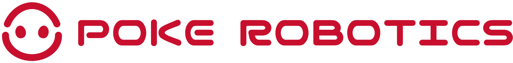

# Poke Robotics — 品牌与产品策略思考

> 更新：2026-03-17 | 作者：许嘉昭

这份文档是基于和创始人许华哲先生初步交流后，再结合我个人对消费类机器人的行业理解+远景后，形成的对 Poke Robotics 品牌、产品和对外表达的初步思考+整理，我期待这是一份具备启发性的文章，也希望它最后所拆解出来的ToDo可以切实帮助到Poke在做好机器人技术本身的同时，做好它的配套工作。

---

## 一、我怎么理解这家公司

Poke Robotics 现在的状态是：一群工程师想做一件改变世界的事，但还没有找到那个"一句话让所有人明白你在做什么"的表达（请注意，我说的是表达，我相信许老师本人有自己明确的计划，但是对外的表达需要包装）。

三条主线（AI、产品、生态/PR）是内部组织逻辑，但对外面的人——用户、媒体、投资人、未来的候选人——他们只想知道一个问题：**你们做的东西，跟我有什么关系？**

我的判断是：这家公司的核心故事不是"我们技术多强"，而是 **"我们要让机器人真正走进你家"**。这里的我特地用“你”这个字眼是希望强调Poke和消费者之间的二元关系，这里没有第三者，从消费者视角来看，“我”消费购买Poke的机器人，带回我自己家，这个故事的力量在于它非常直觉、非常情感化，而且市面上没有其他机器人公司真的做到了。（当然，机器人都还在跳舞表演）

---

## 二、我怎么理解“机器‘人’”，以及如何做好

许老师说：**我们期待2年的时间里，定义出一款可以卖进千家万户的可以干活的机器人。**

在我理解这绝对不是再做一次扫地机器人这么简单，而是要让用户把Poke机器人当作一个可以领回家，去操作一系列家用电器（包括其他所谓机器人），去参与家庭日常行为的“管家/保姆”：

### 扫地机器人解决的是问题，Poke 解决的是关系

扫地机器人是工具。它的价值公式很简单：省时间 = 有用。所以它长得像个冰球没关系，你不需要跟它有情感连接。

但 Poke 要做的事情不一样。一个在家里走来走去、帮你干活的类人型机器人，用户天然会用"相处"的心态去面对它——它不是一个放在角落充电的设备，它是一个会出现在你视野里的**存在**。

这就意味着：
- **外观**不是工业设计问题，是**心理预期管理**。类人外形给用户的隐性承诺是"我可以像对人一样对你"。
- **人格模拟**不是花哨功能，是**使用体验的底层架构**。如果它长得像人但行为像机器，反而会让人不舒服（恐怖谷效应的另一面）。
- **能干活**是最基本的尊重。如果它长得像人却什么都不会做，那就是一个昂贵的表演道具。

### 上述远景实现则将是机器人行业的 iPhone 时刻

iPhone 成功不是因为它是第一台手机，而是因为它是第一台将电话、上网、音乐、应用商店等细碎功能有机整合呈现给用户的移动终端，这让普通人觉得手里有一台 iPhone 代表着“无限可能”。我无数次听到人们质疑买一台宇树G1回去之后能做什么，除了科研发论文，表演节目之外有什么机会吗？这正像在2005年问一个小学生，你是否想要一台手机，他可能会说想，但大概率原因是因为它很酷，而不是真的需要。

所以对机器人行业来说，iPhone 时刻 = **从"哇，好酷"到"我家需要一个"的跨越**。我认为这个时刻应该是 Poke 的目标。

这个跨越要靠三件事：
1. **有用**（不是表演，是真的能完成具体任务，可以帮助用户完成基本的家务或者其他工作）
2. **好看**（让用户可以毫无迟疑的把它买回家，哪怕摆在角落也赏心悦目）
3. **好用**（可以和用户建立在底层需求之上的高纬度需求，如情感、尊重等）

---

## 三、为了做好机器人，Poke 要传达什么？

技术再强，如果用户不知道Poke在做什么、为什么做，那就可能陷入自嗨陷阱。Poke 需要一套清晰的对外表达体系，让每一个接触到 Poke 的人，在 3 秒内理解"这家公司跟别人有什么不一样"。

### Poke 主张：是家人，而非机器

在看了这么这么多中美企业做的“人形机器人后”，我觉得最有力的一句Tagline，可以帮助到 Poke 的表达也许可以是——**「是家人，而非机器」**（英文：Family, not a machine.）。

这句话回答了用户心里最大的疑问："你们的机器人跟那些翻跟头的有什么区别？"答案不是参数、不是技术路线，而是一个承诺：**Poke做的不是一台冷冰冰的电器，而是一个可以融入你家庭的“机器人”。**

这句话同时也暗含了做好家庭机器人的长远目标——不做表演机器人，做真正能走进千家万户的产品。

当然这句话可能在当下对于普罗大众会有一定的认可困难，毕竟80% 非early adaptor可能无论如何都不太会接受机器人进入家庭，但我相信随着时间的推移，大众终将接受这一点。

### Poke 产品哲学

给予我的一些想法，我愿意为一个好的家用机器人提炼如下三句话：

**01 — 形态即态度（Form is intention）**
> 选择类人外形不是为了炫技，而是因为家需要一个"人"——不是一台机器。如果它长得像生物，那它就承载了情绪意义。

**02 — 能力即尊重（Utility is respect）**
> 能干活，是对用户时间的尊重。不表演，是对用户智商的尊重。

**03 — 人格即连接（Personality is connection）**
> 模拟人格不是欺骗，是让人与机器人之间的相处自然发生。温暖不是一个功能，是一个设计原则。

而用一句话总结Poke态度则是：

> 「我们不制造表演机器，我们创造*属于你的*家庭机器人。」
> "We don't build performing machines. We build home robots that *belong to you*."

这句话的力量在于"表演"和"属于"的对比。市面上的人形机器人几乎都还停留在"表演"阶段——翻跟头、跳舞、做俯卧撑。Poke 要做的事情恰好相反：不表演，而是真正进入家庭干活。一句话就把 Poke 和所有竞品拉开了距离。

已于上述结构，无论是官网、PR 物料、招聘 JD 还是投资人 deck，所有的对外表达都可以基于此开枝散叶。

---

## 四、与创始人 IP 相辅相成

创始人许华哲的个人 IP 要和公司深度绑定，但呈现上要更亲切、更有朋友感、画面要更温馨。（这里必须要提一下，如果有视频录制、直播的场景，一定要注意画面光感和呈现，要让观众看视频的时候的第一感觉是“我和许老师在家里对谈”）

我的思路是：**公司品牌是"理想"，创始人 IP 是"过程"。**

- 公司品牌讲的是"我们要做什么" — 宏大、有信念感、质感偏高
- 创始人 IP 讲的是"我们怎么做的" — 真实、有烟火气、Build in Public

两者不矛盾，反而互补：看了公司品牌觉得"这个目标好大"，看了许老师日常觉得"这些人真的在一步步做"。

内容形式建议：
- **播客**：技术思考 + 创业故事，偏深度
- **短视频/vlog**：办公室日常、机器人调试过程偏轻松（类家庭环境加大分）
- **年度总结**：Build in Public 的标志性内容格式
- **视觉风格**：和公司主品牌共用色系，但更手绘/更有温度，比如手写字体、随手拍质感

---

## 五、Logo Reimagine

在一切开始前，我对Logo做了一些简单优化。用更简洁的视觉元素表达了“破壳”+“机器人”，并且对字体做了适当调整。

而品牌颜色我选择了 #c8102e British Red 颜色，这是一个非常古典，沉稳的红色，我认为这个颜色会帮助 Poke 在机器人这个前卫的赛道里面，提醒大众 “Poke 是一家务实的公司”，同时这个颜色和一些中国大陆传统电商相近，方便日后拓展品牌线上电商场景。

| 版本 | 用途 |
|------|------|
| 全称横排 | 正式场景、桌面端导航、品牌物料 |
| 两行紧凑 | 移动端、空间受限场景 |
| 图标 | Favicon、App图标、社媒头像 |

  

  

  

### 设计原则

1. **简洁可辨**：摒弃之前过于繁琐的版本，确保在 favicon、社媒头像、水印等极小尺寸下依然清晰。
2. **品牌红 `#c8102e`**：这是 Poke 的主题色。使用上保持克制——不是到处刷红，而是只在关键品牌触点出现，让红色本身成为一种"信号"。
4. **多版本策略**：不同场景用不同版本，ICON、单行、双行，适合不同尺寸的展示容器。

---

## 六、对机器人工业设计的初步想法

对于进入千家万户的机器人的外观造型，我大概有如下想法：

1. **不要"科幻感"**：走进千家万户的东西不能让人觉得"这是个实验品"。参考路径：Dyson 不是科幻感，是"高级家电感"。
2. **材质要有温度**：金属 + 硬塑料 = 冷冰冰。可以考虑织物包裹、圆润曲线、哑光质感。
3. **尺度感很重要**：太大会有压迫感，太小会觉得像玩具。需要找到"家庭成员"的合适体量。
4. **面部/头部是关键**：这是用户建立情感连接的第一触点。不需要高仿真人脸，但需要一个可以让人"读出表情"的界面。

  

---

## 七、官网

我简单做了一下官网Demo，它是 Poke 对外表达体系的第一个完整载体——上面提到的核心主张、产品哲学、Logo，都需要在这里落地成一个用户可以真正看到、感受到的东西。

设计理念上，配色以中性色为主（白底、深灰文字、浅灰卡片），品牌红克制使用——只在最关键的地方点亮，而不是满屏都是。整体感觉应该像一个有品位的产品公司，而不是一个炫技的科技公司。页面上的每一块内容都有明确的功能——首屏建立第一印象，价值观区域传递产品哲学，

  

---

## 八、Todos

以上是对 Poke Robotics 品牌和产品表达的初步思考框架。其余应该推动的工作如下：

### 已完成 
- [x] 品牌表达体系建立（核心主张 + 产品哲学）
- [x] Logo 体系设计（三版本覆盖全场景）
- [x] 官网上线（中英双语、响应式、完整品牌表达落地）

### P0 — 尽快推进
- [ ] 创始人短片发布 & 配套宣传物料准备
- [ ] 确定产品核心形态与差异化卖点
- [ ] 建立对外传播渠道（公众号、社媒账号）

### P1 — 重要
- [ ] 创始人个人 IP 内容启动（Build in Public）
- [ ] 产品工业设计方向确定（配合设计师到位）
- [ ] 完整官网迭代（从 Landing Page 扩展为多页面站点）

### P2 — 后续
- [ ] 办公空间 & 品牌场景搭建，办公室将是公司直播、对外宣传的重要阵地（可参考影视飓风的做法）

